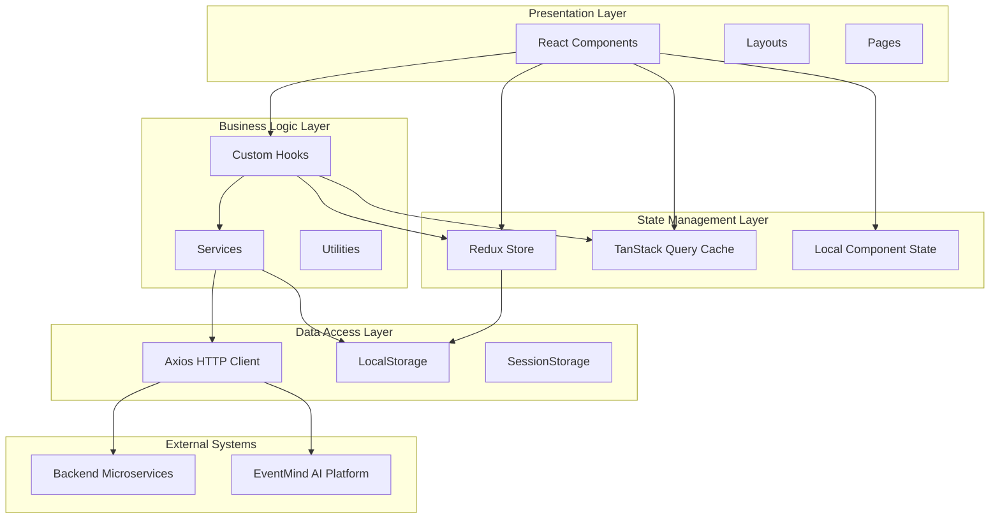
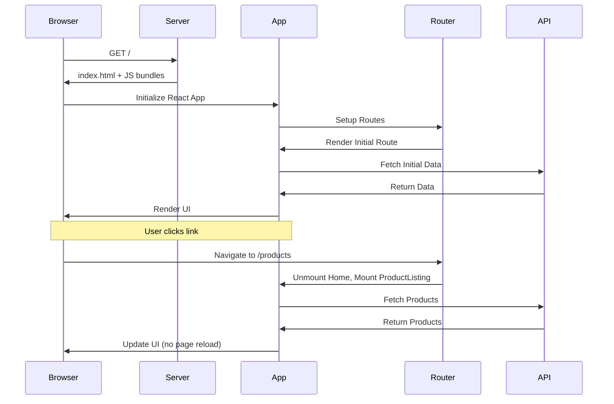
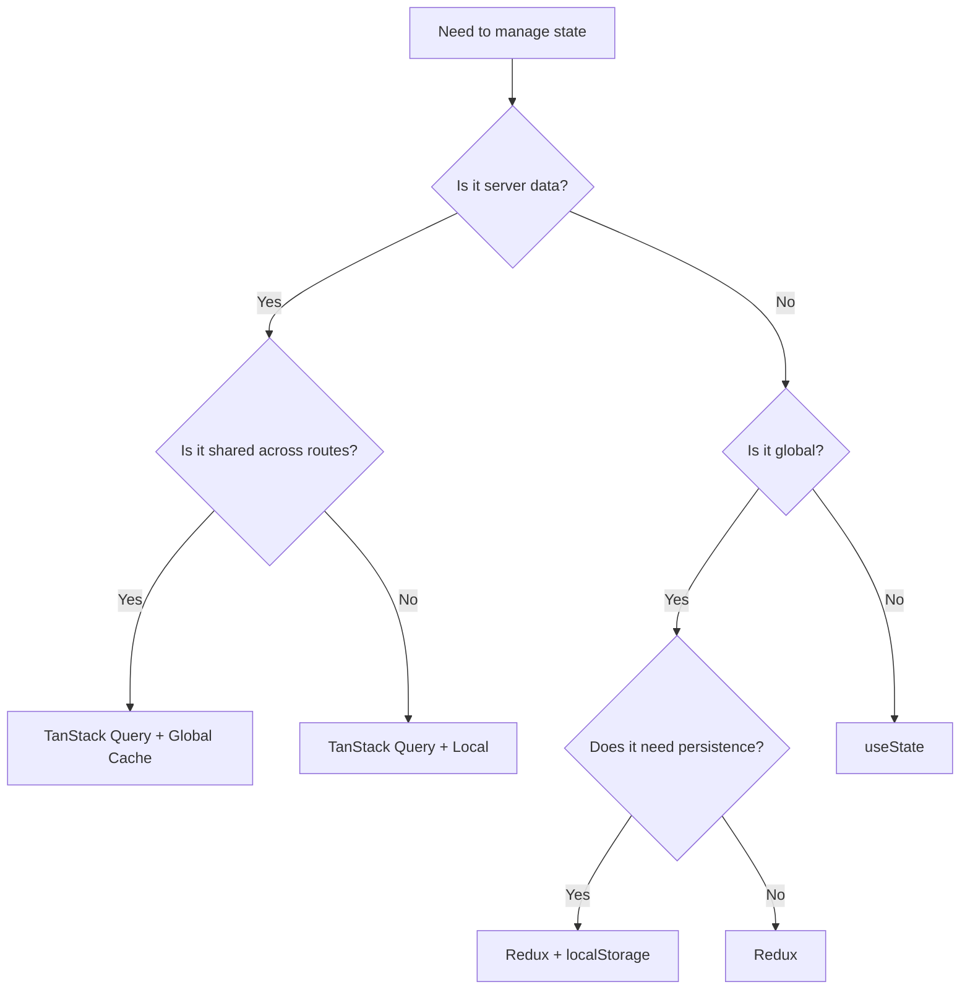
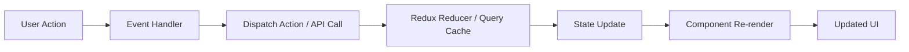
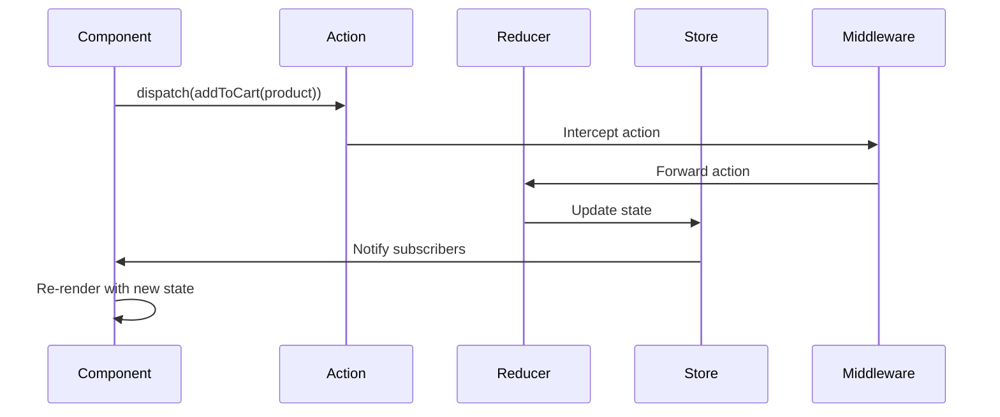
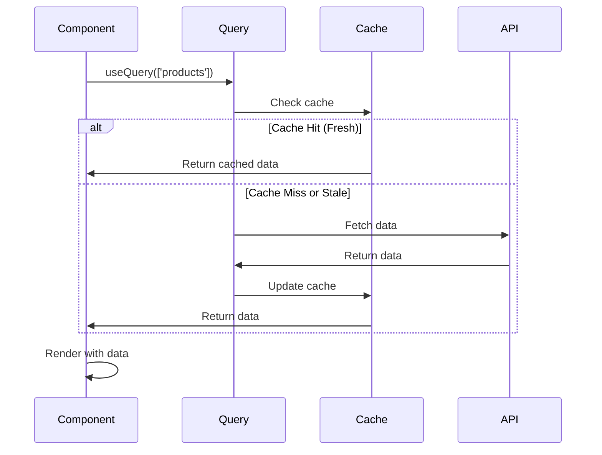
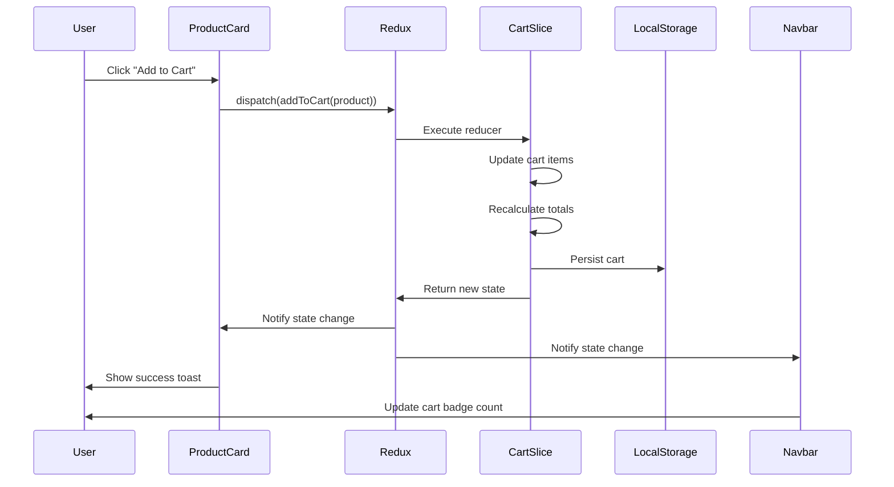

# EventMind AI E-Commerce Platform - Low-Level Design Document

## Document Control

| **Attribute** | **Details** |
|---------------|-------------|
| **Project Name** | EventMind AI E-Commerce Platform Frontend |
| **Document Type** | Low-Level Design (LLD) |
| **Version** | 1.0.0 |
| **Document Status** | Final |
| **Classification** | Internal - Engineering |
| **Last Updated** | 2026-05-26 |
| **Author** | EventMind AI Engineering Team |
| **Reviewers** | Architecture Review Board |
| **Approvers** | Principal Engineer, Engineering Manager |

---

## Document Revision History

| **Version** | **Date** | **Author** | **Changes** | **Approver** |
|-------------|----------|------------|-------------|-------------|
| 1.0.0 | 2026-05-26 | EventMind AI Team | Initial LLD creation | Architecture Board |

---

## Table of Contents

1. [Introduction](#1-introduction)
   - 1.1 [Purpose](#11-purpose)
   - 1.2 [Scope](#12-scope)
   - 1.3 [Objectives](#13-objectives)
   - 1.4 [Assumptions](#14-assumptions)
   - 1.5 [Design Principles](#15-design-principles)

2. [Frontend Architecture Overview](#2-frontend-architecture-overview)
   - 2.1 [Architectural Style](#21-architectural-style)
   - 2.2 [Component-Driven Architecture](#22-component-driven-architecture)
   - 2.3 [Feature-Based Modular Architecture](#23-feature-based-modular-architecture)
   - 2.4 [SPA Architecture](#24-spa-architecture)
   - 2.5 [State Management Strategy](#25-state-management-strategy)
   - 2.6 [Data Flow Architecture](#26-data-flow-architecture)

3. [Detailed Folder Structure](#3-detailed-folder-structure)
   - 3.1 [src/api/](#31-srcapi)
   - 3.2 [src/assets/](#32-srcassets)
   - 3.3 [src/components/](#33-srccomponents)
   - 3.4 [src/hooks/](#34-srchooks)
   - 3.5 [src/layouts/](#35-srclayouts)
   - 3.6 [src/pages/](#36-srcpages)
   - 3.7 [src/routes/](#37-srcroutes)
   - 3.8 [src/services/](#38-srcservices)
   - 3.9 [src/store/](#39-srcstore)
   - 3.10 [src/styles/](#310-srcstyles)
   - 3.11 [src/types/](#311-srctypes)
   - 3.12 [src/utils/](#312-srcutils)

4. [Module-Wise Low-Level Design](#4-module-wise-low-level-design)
   - 4.1 [Home Module](#41-home-module)
   - 4.2 [Product Listing Module](#42-product-listing-module)
   - 4.3 [Product Detail Module](#43-product-detail-module)
   - 4.4 [Cart Module](#44-cart-module)
   - 4.5 [Checkout Module](#45-checkout-module)
   - 4.6 [Login Module](#46-login-module)
   - 4.7 [Signup Module](#47-signup-module)
   - 4.8 [Forgot Password Module](#48-forgot-password-module)
   - 4.9 [Orders Module](#49-orders-module)
   - 4.10 [Order Detail Module](#410-order-detail-module)
   - 4.11 [Admin Dashboard Module](#411-admin-dashboard-module)
   - 4.12 [EventMind Operations Center Module](#412-eventmind-operations-center-module)

5. [Component Design](#5-component-design)
   - 5.1 [Button Component](#51-button-component)
   - 5.2 [Input Component](#52-input-component)
   - 5.3 [Card Component](#53-card-component)
   - 5.4 [Modal Component](#54-modal-component)
   - 5.5 [Navbar Component](#55-navbar-component)
   - 5.6 [Footer Component](#56-footer-component)
   - 5.7 [Loader/Spinner Component](#57-loaderspinner-component)
   - 5.8 [Toast Component](#58-toast-component)
   - 5.9 [ProductCard Component](#59-productcard-component)
   - 5.10 [SearchBar Component](#510-searchbar-component)
   - 5.11 [Pagination Component](#511-pagination-component)
   - 5.12 [FilterSidebar Component](#512-filtersidebar-component)

6. [Routing Design](#6-routing-design)
   - 6.1 [Public Routes](#61-public-routes)
   - 6.2 [Protected Routes](#62-protected-routes)
   - 6.3 [Admin Routes](#63-admin-routes)
   - 6.4 [Lazy Loading Strategy](#64-lazy-loading-strategy)
   - 6.5 [Route Guards](#65-route-guards)
   - 6.6 [Navigation Flow](#66-navigation-flow)

7. [State Management Design](#7-state-management-design)
   - 7.1 [Redux Toolkit Architecture](#71-redux-toolkit-architecture)
   - 7.2 [Store Structure](#72-store-structure)
   - 7.3 [Slices](#73-slices)
   - 7.4 [Reducers](#74-reducers)
   - 7.5 [Async Thunks](#75-async-thunks)
   - 7.6 [TanStack Query Usage](#76-tanstack-query-usage)
   - 7.7 [Caching Strategy](#77-caching-strategy)
   - 7.8 [Optimistic Updates](#78-optimistic-updates)
   - 7.9 [Invalidation Strategy](#79-invalidation-strategy)

8. [API Integration Layer](#8-api-integration-layer)
   - 8.1 [Axios Configuration](#81-axios-configuration)
   - 8.2 [Interceptors](#82-interceptors)
   - 8.3 [JWT Token Handling](#83-jwt-token-handling)
   - 8.4 [Retry Logic](#84-retry-logic)
   - 8.5 [Timeout Strategy](#85-timeout-strategy)
   - 8.6 [API Abstraction Pattern](#86-api-abstraction-pattern)
   - 8.7 [Environment-Based Configuration](#87-environment-based-configuration)

9. [Authentication & Security Design](#9-authentication--security-design)
   - 9.1 [JWT Flow](#91-jwt-flow)
   - 9.2 [Token Refresh Mechanism](#92-token-refresh-mechanism)
   - 9.3 [Protected Routes](#93-protected-routes)
   - 9.4 [Session Persistence](#94-session-persistence)
   - 9.5 [Role-Based Access Control](#95-role-based-access-control)
   - 9.6 [XSS Protection](#96-xss-protection)
   - 9.7 [CSRF Considerations](#97-csrf-considerations)
   - 9.8 [Secure Storage Strategy](#98-secure-storage-strategy)

10. [Performance Optimization Design](#10-performance-optimization-design)
    - 10.1 [Lazy Loading](#101-lazy-loading)
    - 10.2 [Code Splitting](#102-code-splitting)
    - 10.3 [Memoization](#103-memoization)
    - 10.4 [React Optimization](#104-react-optimization)
    - 10.5 [Image Optimization](#105-image-optimization)
    - 10.6 [Caching](#106-caching)
    - 10.7 [Bundle Optimization](#107-bundle-optimization)
    - 10.8 [Render Optimization](#108-render-optimization)

11. [Error Handling Strategy](#11-error-handling-strategy)
    - 11.1 [Global Error Boundary](#111-global-error-boundary)
    - 11.2 [API Error Handling](#112-api-error-handling)
    - 11.3 [Fallback UI](#113-fallback-ui)
    - 11.4 [Retry Mechanism](#114-retry-mechanism)
    - 11.5 [Graceful Degradation](#115-graceful-degradation)
    - 11.6 [User Notifications](#116-user-notifications)

12. [Responsive Design Strategy](#12-responsive-design-strategy)
    - 12.1 [Mobile-First Architecture](#121-mobile-first-architecture)
    - 12.2 [Breakpoints](#122-breakpoints)
    - 12.3 [Adaptive Layouts](#123-adaptive-layouts)
    - 12.4 [Accessibility Compliance](#124-accessibility-compliance)
    - 12.5 [Responsive Grid Strategy](#125-responsive-grid-strategy)

13. [EventMind AI Operations Center LLD](#13-eventmind-ai-operations-center-lld)
    - 13.1 [Incident Dashboard Design](#131-incident-dashboard-design)
    - 13.2 [Service Health Visualization](#132-service-health-visualization)
    - 13.3 [Kafka Monitoring Visualization](#133-kafka-monitoring-visualization)
    - 13.4 [DLQ Monitoring UI](#134-dlq-monitoring-ui)
    - 13.5 [Distributed Trace Visualization](#135-distributed-trace-visualization)
    - 13.6 [AI Remediation Panel](#136-ai-remediation-panel)
    - 13.7 [Real-Time Event Streaming Strategy](#137-real-time-event-streaming-strategy)
    - 13.8 [WebSocket/SSE Integration](#138-websocketsse-integration)
    - 13.9 [Polling Strategy](#139-polling-strategy)
    - 13.10 [Incident State Management](#1310-incident-state-management)
    - 13.11 [AI Recommendation Rendering](#1311-ai-recommendation-rendering)

14. [Logging & Monitoring Strategy](#14-logging--monitoring-strategy)
    - 14.1 [Frontend Logging](#141-frontend-logging)
    - 14.2 [Telemetry](#142-telemetry)
    - 14.3 [Error Tracking](#143-error-tracking)
    - 14.4 [Analytics Integration](#144-analytics-integration)
    - 14.5 [Observability Hooks](#145-observability-hooks)

15. [Docker & Deployment Design](#15-docker--deployment-design)
    - 15.1 [Dockerfile Structure](#151-dockerfile-structure)
    - 15.2 [Nginx Configuration](#152-nginx-configuration)
    - 15.3 [Environment Configurations](#153-environment-configurations)
    - 15.4 [CI/CD Compatibility](#154-cicd-compatibility)
    - 15.5 [Production Deployment Flow](#155-production-deployment-flow)

16. [Future Scalability Design](#16-future-scalability-design)
    - 16.1 [Microfrontend Possibilities](#161-microfrontend-possibilities)
    - 16.2 [SSR Migration](#162-ssr-migration)
    - 16.3 [PWA Support](#163-pwa-support)
    - 16.4 [Kubernetes Compatibility](#164-kubernetes-compatibility)
    - 16.5 [Edge Deployment Readiness](#165-edge-deployment-readiness)

17. [Risks & Mitigations](#17-risks--mitigations)
    - 17.1 [Frontend Bottlenecks](#171-frontend-bottlenecks)
    - 17.2 [API Dependency Risks](#172-api-dependency-risks)
    - 17.3 [Scalability Concerns](#173-scalability-concerns)
    - 17.4 [State Management Complexity](#174-state-management-complexity)
    - 17.5 [Mitigation Strategies](#175-mitigation-strategies)

18. [Conclusion](#18-conclusion)

---

# 1. Introduction

## 1.1 Purpose

This Low-Level Design (LLD) document provides comprehensive technical specifications for the **EventMind AI E-Commerce Platform Frontend**, an enterprise-grade, production-ready web application architected as an **AI-Ready Enterprise Observability Frontend**. This document serves as the definitive technical blueprint for:

- **Engineering Implementation**: Detailed component specifications, state management patterns, and API integration strategies
- **Architecture Governance**: Compliance with enterprise architecture standards and design patterns
- **Code Review & Quality Assurance**: Reference for code reviews, technical debt assessment, and quality gates
- **Knowledge Transfer**: Onboarding documentation for new engineers joining the platform team
- **Technical Presentations**: Foundation for architecture review boards, technical showcases, and stakeholder demonstrations

The document bridges the gap between the High-Level Design (HLD) and actual implementation, providing granular details on every architectural component, design pattern, and technical decision.

## 1.2 Scope

### 1.2.1 In-Scope

This LLD document covers:

**Frontend Application Architecture**:
- Complete React 18 + TypeScript component hierarchy
- Redux Toolkit state management implementation
- TanStack Query server state caching strategy
- React Router v6 navigation and routing architecture
- Tailwind CSS responsive design system

**E-Commerce Functionality**:
- Product catalog browsing with advanced filtering
- Shopping cart management with persistence
- Multi-step checkout flow
- Order management and tracking
- User authentication and authorization

**EventMind AI Integration**:
- Real-time service health monitoring dashboard
- Incident management and visualization
- AI-powered remediation suggestion rendering
- Kafka event stream monitoring (placeholder)
- Distributed tracing visualization (placeholder)
- Dead Letter Queue (DLQ) monitoring

**Cross-Cutting Concerns**:
- Security architecture (JWT, RBAC, XSS protection)
- Performance optimization strategies
- Error handling and resilience patterns
- Responsive design and accessibility
- Deployment and containerization

### 1.2.2 Out-of-Scope

- Backend microservices implementation details
- Database schema design
- Kafka cluster configuration
- AI/ML model training and deployment
- Infrastructure provisioning (Kubernetes, cloud resources)
- Third-party payment gateway integration details

## 1.3 Objectives

### 1.3.1 Technical Objectives

1. **Maintainability**: Establish a modular, well-documented codebase that supports long-term evolution
2. **Scalability**: Design for horizontal scaling and future microfrontend migration
3. **Performance**: Achieve sub-2-second page load times with optimized bundle sizes
4. **Reliability**: Implement comprehensive error handling and fallback mechanisms
5. **Security**: Enforce industry-standard security practices for authentication and data protection
6. **Developer Experience**: Provide type-safe, linted, and well-structured code with clear separation of concerns

### 1.3.2 Business Objectives

1. **User Experience**: Deliver a seamless, intuitive shopping experience across all devices
2. **Operational Excellence**: Enable real-time monitoring and AI-driven incident remediation
3. **Time-to-Market**: Accelerate feature development through reusable components and clear patterns
4. **Cost Efficiency**: Optimize resource utilization through efficient caching and code splitting

## 1.4 Assumptions

### 1.4.1 Technical Assumptions

- **Browser Support**: Modern browsers (Chrome, Firefox, Safari, Edge) with ES6+ support
- **Network Connectivity**: Users have stable internet connections (minimum 3G)
- **Backend Availability**: Microservices expose RESTful APIs with consistent response formats
- **Authentication**: Backend provides JWT-based authentication with refresh token support
- **Development Environment**: Node.js 18+ and npm/yarn package managers available

### 1.4.2 Business Assumptions

- **User Base**: Target audience is tech-savvy users comfortable with modern web applications
- **Product Catalog**: Maximum 10,000 products in the catalog
- **Concurrent Users**: System designed to handle 10,000+ concurrent users
- **Geographic Distribution**: Global user base requiring CDN distribution

### 1.4.3 Deployment Assumptions

- **Hosting Platform**: Netlify for primary deployment with Docker as alternative
- **CI/CD**: GitHub Actions or similar CI/CD pipeline for automated deployments
- **Environment Separation**: Distinct development, staging, and production environments

## 1.5 Design Principles

### 1.5.1 SOLID Principles

**Single Responsibility Principle (SRP)**:
- Each component has a single, well-defined responsibility
- Services are dedicated to specific API domains (auth, product, order)
- Redux slices manage isolated state domains

**Open/Closed Principle (OCP)**:
- Components are open for extension through props and composition
- Closed for modification through stable interfaces

**Liskov Substitution Principle (LSP)**:
- Component variants are substitutable without breaking functionality
- Interface contracts are honored across implementations

**Interface Segregation Principle (ISP)**:
- Components expose minimal, focused prop interfaces
- No component is forced to depend on unused props

**Dependency Inversion Principle (DIP)**:
- High-level components depend on abstractions (hooks, services)
- Low-level details (API calls, storage) are abstracted behind interfaces

### 1.5.2 React-Specific Principles

**Component Composition**:
- Favor composition over inheritance
- Build complex UIs from simple, reusable components
- Use children props and render props for flexibility

**Unidirectional Data Flow**:
- Data flows from parent to child via props
- State updates flow through Redux actions and reducers
- No direct DOM manipulation

**Declarative Programming**:
- Describe what the UI should look like, not how to build it
- React handles efficient DOM updates

**Immutability**:
- Never mutate state directly
- Use Redux Toolkit's Immer for immutable updates
- Prevent unintended side effects

### 1.5.3 Clean Architecture Principles

**Separation of Concerns**:
```
Presentation Layer (Components)
       ↓
Application Layer (Hooks, State Management)
       ↓
Domain Layer (Services, Business Logic)
       ↓
Infrastructure Layer (API, Storage)
```

**Dependency Rule**:
- Outer layers depend on inner layers
- Inner layers are independent of outer layers
- Core business logic is isolated from frameworks

**Testability**:
- Components are pure and testable
- Business logic is decoupled from UI
- Dependencies are injectable

### 1.5.4 Performance Principles

- **Lazy Loading**: Load code on-demand to reduce initial bundle size
- **Memoization**: Cache expensive computations and component renders
- **Code Splitting**: Split bundles by route and feature
- **Asset Optimization**: Compress and cache static assets
- **Efficient Rendering**: Minimize unnecessary re-renders

### 1.5.5 Security Principles

- **Defense in Depth**: Multiple layers of security controls
- **Least Privilege**: Users and components have minimum necessary permissions
- **Secure by Default**: Security features enabled by default
- **Input Validation**: All user inputs are validated and sanitized
- **Secure Communication**: HTTPS-only in production

---

# 2. Frontend Architecture Overview

## 2.1 Architectural Style

The EventMind AI E-Commerce Platform adopts a **Hybrid Layered Architecture** combining:

1. **Component-Based Architecture** (React)
2. **Flux Architecture** (Redux Toolkit)
3. **Service-Oriented Architecture** (API Services)
4. **Event-Driven Architecture** (EventMind AI Integration)

### 2.1.1 Architectural Layers



### 2.1.2 Architectural Characteristics

| **Characteristic** | **Approach** | **Rationale** |
|-------------------|--------------|---------------|
| **Modularity** | Feature-based folder structure | Enables independent development and testing |
| **Scalability** | Code splitting, lazy loading | Supports growing codebase and user base |
| **Maintainability** | TypeScript, clear separation of concerns | Reduces technical debt, eases refactoring |
| **Testability** | Pure components, dependency injection | Facilitates unit and integration testing |
| **Performance** | Memoization, caching, optimization | Ensures fast page loads and smooth UX |
| **Security** | JWT, RBAC, input validation | Protects user data and prevents attacks |

## 2.2 Component-Driven Architecture

### 2.2.1 Atomic Design Methodology

The application follows **Atomic Design** principles:

```
Atoms (Basic Building Blocks)
  ├─ Button
  ├─ Input
  ├─ Badge
  ├─ Spinner
  └─ Card

Molecules (Simple Combinations)
  ├─ FormField (Input + Label + Error)
  ├─ SearchBar (Input + Button)
  └─ PriceDisplay (Text + Badge)

Organisms (Complex Components)
  ├─ Navbar (Logo + Navigation + SearchBar + Cart Icon)
  ├─ Footer (Links + Social + Newsletter)
  ├─ ProductCard (Image + Title + Price + Rating + Button)
  └─ FilterSidebar (Multiple FormFields + Buttons)

Templates (Page Layouts)
  └─ MainLayout (Navbar + Outlet + Footer)

Pages (Specific Instances)
  ├─ HomePage
  ├─ ProductListingPage
  ├─ ProductDetailPage
  └─ ...
```

### 2.2.2 Component Classification

**Presentational Components** (Dumb Components):
- Concerned with how things look
- Receive data and callbacks via props
- No state management (except UI state)
- Highly reusable

**Example**:
```typescript
interface ButtonProps {
  children: React.ReactNode;
  onClick?: () => void;
  variant?: 'primary' | 'secondary' | 'outline';
  disabled?: boolean;
}

export const Button: React.FC<ButtonProps> = ({ 
  children, 
  onClick, 
  variant = 'primary',
  disabled = false 
}) => {
  // Pure presentational logic
};
```

**Container Components** (Smart Components):
- Concerned with how things work
- Connect to Redux store or data sources
- Manage state and business logic
- Pass data to presentational components

**Example**:
```typescript
export const ProductListingPage: React.FC = () => {
  const { data: products, isLoading } = useQuery(...);
  const dispatch = useDispatch();
  
  const handleAddToCart = (product: Product) => {
    dispatch(addToCart({ product }));
  };
  
  return (
    <ProductList 
      products={products} 
      onAddToCart={handleAddToCart}
      isLoading={isLoading}
    />
  );
};
```

### 2.2.3 Component Communication Patterns

**Parent-to-Child (Props)**:
```typescript
<ProductCard 
  product={product}
  onAddToCart={handleAddToCart}
/>
```

**Child-to-Parent (Callbacks)**:
```typescript
interface ProductCardProps {
  product: Product;
  onAddToCart: (product: Product) => void;
}

const ProductCard: React.FC<ProductCardProps> = ({ product, onAddToCart }) => {
  return (
    <button onClick={() => onAddToCart(product)}>
      Add to Cart
    </button>
  );
};
```

**Sibling-to-Sibling (Lifting State Up)**:
```typescript
const ParentComponent = () => {
  const [selectedCategory, setSelectedCategory] = useState('');
  
  return (
    <>
      <FilterSidebar 
        selectedCategory={selectedCategory}
        onCategoryChange={setSelectedCategory}
      />
      <ProductList 
        category={selectedCategory}
      />
    </>
  );
};
```

**Global Communication (Redux)**:
```typescript
// Component A
const ComponentA = () => {
  const dispatch = useDispatch();
  dispatch(addToCart({ product }));
};

// Component B
const ComponentB = () => {
  const cartItems = useSelector((state) => state.cart.items);
};
```

## 2.3 Feature-Based Modular Architecture

### 2.3.1 Module Organization

The application is organized by **features** rather than technical layers:

```
src/
├─ pages/              # Feature modules
│  ├─ Home/
│  ├─ ProductListing/
│  ├─ ProductDetail/
│  ├─ Cart/
│  ├─ Checkout/
│  ├─ Orders/
│  ├─ admin/
│  │  └─ Dashboard/
│  └─ EventMindOps/
├─ components/         # Shared components
│  ├─ layout/
│  └─ ui/
├─ services/          # API services
├─ store/             # State management
└─ hooks/             # Shared hooks
```

### 2.3.2 Module Boundaries

**Strict Dependency Rules**:
- Pages can import from: components, hooks, services, store, utils
- Components can import from: hooks, store, utils
- Services can import from: api, utils, types
- Hooks can import from: store, utils
- Utils are dependency-free

**Anti-Pattern (Circular Dependencies)**:
```typescript
// ❌ BAD: Circular dependency
// services/productService.ts imports from pages/ProductDetail
// pages/ProductDetail imports from services/productService
```

**Correct Pattern**:
```typescript
// ✅ GOOD: Unidirectional dependency
// pages/ProductDetail → services/productService → api/axiosInstance
```

## 2.4 SPA Architecture

### 2.4.1 Single-Page Application Characteristics

**Client-Side Routing**:
- React Router manages navigation without full page reloads
- URL changes update browser history
- Components mount/unmount based on route

**Dynamic Content Loading**:
- Initial HTML shell loads once
- JavaScript bundle hydrates the application
- Subsequent navigation fetches data via API calls

**State Persistence**:
- Application state persists across route changes
- No state loss during navigation
- Redux store remains active

### 2.4.2 SPA Lifecycle



### 2.4.3 SPA Optimization Strategies

**Code Splitting**:
```typescript
const HomePage = lazy(() => import('./pages/Home'));
const ProductListingPage = lazy(() => import('./pages/ProductListing'));

<Suspense fallback={<Spinner />}>
  <Routes>
    <Route path="/" element={<HomePage />} />
    <Route path="/products" element={<ProductListingPage />} />
  </Routes>
</Suspense>
```

**Prefetching**:
```typescript
// Prefetch next likely route
const prefetchProductDetail = (productId: string) => {
  queryClient.prefetchQuery({
    queryKey: ['product', productId],
    queryFn: () => productService.getProductById(productId),
  });
};
```

**Progressive Enhancement**:
- Core functionality works without JavaScript (SEO-friendly HTML)
- Enhanced experience with JavaScript enabled
- Graceful degradation for older browsers

## 2.5 State Management Strategy

### 2.5.1 State Classification

The application manages three types of state:

**1. Server State (TanStack Query)**:
- Data fetched from backend APIs
- Cached and automatically refreshed
- Examples: products, orders, user profile

**2. Client State (Redux Toolkit)**:
- Application-wide state not derived from server
- Examples: authentication, shopping cart, notifications

**3. Local UI State (useState)**:
- Component-specific state
- Examples: form inputs, modal visibility, dropdown state

### 2.5.2 State Management Decision Tree



### 2.5.3 State Management Architecture

```typescript
// Server State (TanStack Query)
const { data: products } = useQuery({
  queryKey: ['products'],
  queryFn: productService.getProducts,
});

// Client State (Redux)
const cartItems = useSelector((state) => state.cart.items);
const dispatch = useDispatch();

// Local UI State (useState)
const [isModalOpen, setIsModalOpen] = useState(false);
```

## 2.6 Data Flow Architecture

### 2.6.1 Unidirectional Data Flow



### 2.6.2 Redux Data Flow



### 2.6.3 TanStack Query Data Flow



### 2.6.4 Complete Data Flow Example

**Scenario: User adds product to cart**



---

# 3. Detailed Folder Structure

## 3.1 src/api/

### 3.1.1 Purpose
Centralized HTTP client configuration and API instance management.

### 3.1.2 Responsibilities
- Configure Axios instances with base URLs and default headers
- Implement request/response interceptors
- Handle JWT token injection
- Manage token refresh logic
- Provide error handling middleware

### 3.1.3 File Structure
```
src/api/
├─ axiosInstance.ts    # Main Axios configuration
└─ index.ts            # Barrel export
```

### 3.1.4 Example Files

**axiosInstance.ts**:
```typescript
import axios, { AxiosInstance, InternalAxiosRequestConfig, AxiosResponse, AxiosError } from 'axios';
import { config } from '../utils/config';
import { STORAGE_KEYS } from '../utils/constants';
import { store } from '../store';
import { logout } from '../store/slices/authSlice';

// Create Axios instance
const axiosInstance: AxiosInstance = axios.create({
  baseURL: config.api.baseURL,
  timeout: 10000,
  headers: {
    'Content-Type': 'application/json',
  },
});

// Request interceptor - Add JWT token
axiosInstance.interceptors.request.use(
  (config: InternalAxiosRequestConfig) => {
    const token = localStorage.getItem(STORAGE_KEYS.AUTH_TOKEN);
    if (token && config.headers) {
      config.headers.Authorization = `Bearer ${token}`;
    }
    return config;
  },
  (error: AxiosError) => Promise.reject(error)
);

// Response interceptor - Handle token refresh
axiosInstance.interceptors.response.use(
  (response: AxiosResponse) => response,
  async (error: AxiosError) => {
    const originalRequest = error.config as InternalAxiosRequestConfig & { _retry?: boolean };
    
    // Handle 401 Unauthorized - Token expired
    if (error.response?.status === 401 && !originalRequest._retry) {
      originalRequest._retry = true;
      
      try {
        const refreshToken = localStorage.getItem(STORAGE_KEYS.REFRESH_TOKEN);
        const response = await axios.post(`${config.api.baseURL}/auth/refresh`, { 
          refreshToken 
        });
        
        const { token } = response.data;
        localStorage.setItem(STORAGE_KEYS.AUTH_TOKEN, token);
        
        if (originalRequest.headers) {
          originalRequest.headers.Authorization = `Bearer ${token}`;
        }
        
        return axiosInstance(originalRequest);
      } catch (refreshError) {
        // Refresh failed - logout user
        store.dispatch(logout());
        window.location.href = '/login';
        return Promise.reject(refreshError);
      }
    }
    
    return Promise.reject(error);
  }
);

export default axiosInstance;
```

### 3.1.5 Dependency Boundaries
- **Imports from**: utils (config, constants), store (for logout action)
- **Imported by**: services layer
- **No imports from**: components, pages, hooks

---

## 3.2 src/assets/

### 3.2.1 Purpose
Static assets bundled with the application (images, fonts, icons).

### 3.2.2 Responsibilities
- Store images imported in components
- Provide SVG icons and logos
- Host fonts (if not using CDN)
- Maintain brand assets

### 3.2.3 File Structure
```
src/assets/
├─ hero.png           # Homepage hero image
├─ react.svg          # React logo
├─ vite.svg           # Vite logo
└─ [future assets]    # Product images, icons, etc.
```

### 3.2.4 Usage Pattern
```typescript
import heroImage from '../assets/hero.png';

const HeroSection = () => (
  
);
```

### 3.2.5 Dependency Boundaries
- **Imports from**: None
- **Imported by**: Components, pages
- **Build Process**: Vite processes and optimizes assets

---

## 3.3 src/components/

### 3.3.1 Purpose
Reusable UI components shared across the application.

### 3.3.2 Responsibilities
- Provide atomic UI building blocks (Button, Input, Card)
- Implement layout components (Navbar, Footer)
- Ensure consistent styling and behavior
- Maintain accessibility standards

### 3.3.3 File Structure
```
src/components/
├─ layout/
│  ├─ Navbar.tsx
│  ├─ Footer.tsx
│  └─ index.ts
└─ ui/
   ├─ Button.tsx
   ├─ Input.tsx
   ├─ Card.tsx
   ├─ Badge.tsx
   ├─ Spinner.tsx
   └─ index.ts
```

### 3.3.4 Component Organization

**Layout Components** (`layout/`):
- **Navbar.tsx**: Application header with navigation, search, cart icon
- **Footer.tsx**: Application footer with links and social media

**UI Components** (`ui/`):
- **Button.tsx**: Reusable button with variants (primary, secondary, outline)
- **Input.tsx**: Form input with label, error message, validation states
- **Card.tsx**: Container component for content grouping
- **Badge.tsx**: Small status indicators (new, sale, low stock)
- **Spinner.tsx**: Loading indicator

### 3.3.5 Example: Button Component

```typescript
import React from 'react';
import { cn } from '../../utils/helpers';

interface ButtonProps extends React.ButtonHTMLAttributes<HTMLButtonElement> {
  variant?: 'primary' | 'secondary' | 'outline' | 'ghost';
  size?: 'sm' | 'md' | 'lg';
  isLoading?: boolean;
  children: React.ReactNode;
}

export const Button = React.forwardRef<HTMLButtonElement, ButtonProps>(
  ({ 
    variant = 'primary', 
    size = 'md', 
    isLoading = false,
    className,
    children,
    disabled,
    ...props 
  }, ref) => {
    const baseStyles = 'inline-flex items-center justify-center rounded-md font-medium transition-colors focus-visible:outline-none focus-visible:ring-2 focus-visible:ring-offset-2 disabled:pointer-events-none disabled:opacity-50';
    
    const variants = {
      primary: 'bg-blue-600 text-white hover:bg-blue-700 focus-visible:ring-blue-600',
      secondary: 'bg-gray-200 text-gray-900 hover:bg-gray-300 focus-visible:ring-gray-500',
      outline: 'border-2 border-blue-600 text-blue-600 hover:bg-blue-50 focus-visible:ring-blue-600',
      ghost: 'text-gray-700 hover:bg-gray-100 focus-visible:ring-gray-500',
    };
    
    const sizes = {
      sm: 'h-8 px-3 text-sm',
      md: 'h-10 px-4 text-base',
      lg: 'h-12 px-6 text-lg',
    };
    
    return (
      <button
        ref={ref}
        className={cn(baseStyles, variants[variant], sizes[size], className)}
        disabled={disabled || isLoading}
        {...props}
      >
        {isLoading && (
          <svg className="mr-2 h-4 w-4 animate-spin" viewBox="0 0 24 24">
            <circle className="opacity-25" cx="12" cy="12" r="10" stroke="currentColor" strokeWidth="4" fill="none" />
            <path className="opacity-75" fill="currentColor" d="M4 12a8 8 0 018-8V0C5.373 0 0 5.373 0 12h4zm2 5.291A7.962 7.962 0 014 12H0c0 3.042 1.135 5.824 3 7.938l3-2.647z" />
          </svg>
        )}
        {children}
      </button>
    );
  }
);

Button.displayName = 'Button';
```

### 3.3.6 Dependency Boundaries
- **Imports from**: utils (helpers, constants), hooks, store (for connected components)
- **Imported by**: pages, layouts, other components
- **No imports from**: services, api

---

## 3.4 src/hooks/

### 3.4.1 Purpose
Custom React hooks for reusable stateful logic.

### 3.4.2 Responsibilities
- Encapsulate reusable logic (authentication, cart, theme)
- Provide clean abstractions over Redux and browser APIs
- Implement common patterns (debounce, localStorage)
- Reduce code duplication across components

### 3.4.3 File Structure
```
src/hooks/
├─ useAuth.ts          # Authentication hook
├─ useCart.ts          # Cart management hook
├─ useTheme.ts         # Dark mode hook
├─ useDebounce.ts      # Debounce hook
├─ useLocalStorage.ts  # LocalStorage hook
└─ index.ts            # Barrel export
```

### 3.4.4 Example: useAuth Hook

```typescript
import { useSelector, useDispatch } from 'react-redux';
import { useNavigate } from 'react-router-dom';
import { RootState } from '../store';
import { setCredentials, logout as logoutAction } from '../store/slices/authSlice';
import { authService } from '../services/authService';
import { User } from '../types';

export const useAuth = () => {
  const dispatch = useDispatch();
  const navigate = useNavigate();
  
  const { user, token, isAuthenticated, isLoading } = useSelector(
    (state: RootState) => state.auth
  );
  
  const login = async (email: string, password: string) => {
    try {
      const response = await authService.login(email, password);
      dispatch(setCredentials({
        user: response.user,
        token: response.token,
        refreshToken: response.refreshToken,
      }));
      return { success: true };
    } catch (error) {
      return { success: false, error: 'Invalid credentials' };
    }
  };
  
  const logout = () => {
    dispatch(logoutAction());
    navigate('/login');
  };
  
  const isAdmin = user?.role === 'admin';
  
  return {
    user,
    token,
    isAuthenticated,
    isLoading,
    isAdmin,
    login,
    logout,
  };
};
```

### 3.4.5 Example: useDebounce Hook

```typescript
import { useState, useEffect } from 'react';

export function useDebounce<T>(value: T, delay: number = 500): T {
  const [debouncedValue, setDebouncedValue] = useState<T>(value);
  
  useEffect(() => {
    const handler = setTimeout(() => {
      setDebouncedValue(value);
    }, delay);
    
    return () => {
      clearTimeout(handler);
    };
  }, [value, delay]);
  
  return debouncedValue;
}
```

### 3.4.6 Dependency Boundaries
- **Imports from**: store, services, utils, types
- **Imported by**: components, pages
- **No imports from**: api (uses services instead)

---

## 3.5 src/layouts/

### 3.5.1 Purpose
Page layout templates that wrap route components.

### 3.5.2 Responsibilities
- Provide consistent page structure (header, content, footer)
- Manage layout-specific state (sidebar, mobile menu)
- Implement responsive layout behavior

### 3.5.3 File Structure
```
src/layouts/
└─ MainLayout.tsx      # Primary application layout
```

### 3.5.4 Example: MainLayout

```typescript
import React from 'react';
import { Outlet } from 'react-router-dom';
import { Navbar } from '../components/layout/Navbar';
import { Footer } from '../components/layout/Footer';

export const MainLayout: React.FC = () => {
  return (
    <div className="flex min-h-screen flex-col">
      <Navbar />
      <main className="flex-1 bg-gray-50">
        <Outlet />
      </main>
      <Footer />
    </div>
  );
};
```

### 3.5.5 Dependency Boundaries
- **Imports from**: components (Navbar, Footer)
- **Imported by**: routes
- **No imports from**: pages, services

---

## 3.6 src/pages/

### 3.6.1 Purpose
Route-level components representing distinct pages/views.

### 3.6.2 Responsibilities
- Implement page-specific business logic
- Fetch data for the page
- Compose UI from reusable components
- Handle page-level state

### 3.6.3 File Structure
```
src/pages/
├─ Home/
│  └─ index.tsx
├─ ProductListing/
│  └─ index.tsx
├─ ProductDetail/
│  └─ index.tsx
├─ Cart/
│  └─ index.tsx
├─ Checkout/
│  └─ index.tsx
├─ Login/
│  └─ index.tsx
├─ Signup/
│  └─ index.tsx
├─ ForgotPassword/
│  └─ index.tsx
├─ Orders/
│  └─ index.tsx
├─ OrderDetail/
│  └─ index.tsx
├─ admin/
│  └─ Dashboard/
│     └─ index.tsx
└─ EventMindOps/
   └─ index.tsx
```

### 3.6.4 Page Organization Pattern

Each page follows a consistent structure:

```typescript
// pages/ProductListing/index.tsx
import React, { useState } from 'react';
import { useQuery } from '@tanstack/react-query';
import { productService } from '../../services';
import { ProductCard, Spinner } from '../../components/ui';
import { useDebounce } from '../../hooks';

export const ProductListingPage: React.FC = () => {
  // 1. State management
  const [filters, setFilters] = useState({});
  const [searchTerm, setSearchTerm] = useState('');
  const debouncedSearch = useDebounce(searchTerm, 500);
  
  // 2. Data fetching
  const { data, isLoading, error } = useQuery({
    queryKey: ['products', filters, debouncedSearch],
    queryFn: () => productService.getProducts(filters, debouncedSearch),
  });
  
  // 3. Event handlers
  const handleFilterChange = (newFilters) => {
    setFilters(newFilters);
  };
  
  // 4. Conditional rendering
  if (isLoading) return <Spinner />;
  if (error) return <ErrorMessage />;
  
  // 5. Main render
  return (
    <div className="container mx-auto">
      {/* Page content */}
    </div>
  );
};
```

### 3.6.5 Dependency Boundaries
- **Imports from**: components, hooks, services, store, utils, types
- **Imported by**: routes
- **No circular dependencies**

---

## 3.7 src/routes/

### 3.7.1 Purpose
Centralized routing configuration and route guards.

### 3.7.2 Responsibilities
- Define all application routes
- Implement route protection (authentication, authorization)
- Configure lazy loading
- Manage navigation flow

### 3.7.3 File Structure
```
src/routes/
├─ index.tsx           # Route definitions
└─ ProtectedRoute.tsx  # Route guard component
```

### 3.7.4 Example: Route Configuration

```typescript
import React, { lazy, Suspense } from 'react';
import { Routes, Route, Navigate } from 'react-router-dom';
import { MainLayout } from '../layouts/MainLayout';
import { ProtectedRoute } from './ProtectedRoute';
import { Spinner } from '../components/ui';

// Lazy load pages
const HomePage = lazy(() => import('../pages/Home'));
const ProductListingPage = lazy(() => import('../pages/ProductListing'));
const ProductDetailPage = lazy(() => import('../pages/ProductDetail'));
const CartPage = lazy(() => import('../pages/Cart'));
const CheckoutPage = lazy(() => import('../pages/Checkout'));
const LoginPage = lazy(() => import('../pages/Login'));
const SignupPage = lazy(() => import('../pages/Signup'));
const OrdersPage = lazy(() => import('../pages/Orders'));
const AdminDashboard = lazy(() => import('../pages/admin/Dashboard'));
const EventMindOpsPage = lazy(() => import('../pages/EventMindOps'));

export const AppRoutes: React.FC = () => {
  return (
    <Suspense fallback={<Spinner />}>
      <Routes>
        <Route element={<MainLayout />}>
          {/* Public Routes */}
          <Route path="/" element={<HomePage />} />
          <Route path="/products" element={<ProductListingPage />} />
          <Route path="/products/:id" element={<ProductDetailPage />} />
          <Route path="/login" element={<LoginPage />} />
          <Route path="/signup" element={<SignupPage />} />
          <Route path="/forgot-password" element={<ForgotPasswordPage />} />
          
          {/* Protected Routes */}
          <Route path="/cart" element={
            <ProtectedRoute>
              <CartPage />
            </ProtectedRoute>
          } />
          <Route path="/checkout" element={
            <ProtectedRoute>
              <CheckoutPage />
            </ProtectedRoute>
          } />
          <Route path="/orders" element={
            <ProtectedRoute>
              <OrdersPage />
            </ProtectedRoute>
          } />
          
          {/* Admin Routes */}
          <Route path="/admin" element={
            <ProtectedRoute requireAdmin>
              <AdminDashboard />
            </ProtectedRoute>
          } />
          <Route path="/eventmind-ops" element={
            <ProtectedRoute requireAdmin>
              <EventMindOpsPage />
            </ProtectedRoute>
          } />
          
          {/* Catch-all */}
          <Route path="*" element={<Navigate to="/" replace />} />
        </Route>
      </Routes>
    </Suspense>
  );
};
```

### 3.7.5 Dependency Boundaries
- **Imports from**: pages, layouts, components, hooks
- **Imported by**: App.tsx
- **No imports from**: services, api

---

## 3.8 src/services/

### 3.8.1 Purpose
API service layer abstracting backend communication.

### 3.8.2 Responsibilities
- Encapsulate API calls
- Transform request/response data
- Handle service-specific errors
- Provide mock data for development

### 3.8.3 File Structure
```
src/services/
├─ authService.ts      # Authentication API
├─ productService.ts   # Product API
├─ orderService.ts     # Order API
├─ mockData.ts         # Mock data
└─ index.ts            # Barrel export
```

### 3.8.4 Example: productService.ts

```typescript
import axiosInstance from '../api/axiosInstance';
import { Product, PaginatedResponse } from '../types';
import { config } from '../utils/config';
import { mockProducts } from './mockData';

const API_ENDPOINTS = {
  PRODUCTS: '/products',
  PRODUCT_DETAIL: (id: string) => `/products/${id}`,
  CATEGORIES: '/categories',
};

export const productService = {
  /**
   * Fetch paginated products with filters
   */
  getProducts: async (
    page: number = 1,
    pageSize: number = 20,
    filters?: {
      category?: string;
      minPrice?: number;
      maxPrice?: number;
      rating?: number;
    },
    sort?: 'price-asc' | 'price-desc' | 'rating' | 'newest'
  ): Promise<PaginatedResponse<Product>> => {
    if (config.app.enableMockData) {
      // Return mock data
      const filteredProducts = mockProducts.filter(p => {
        if (filters?.category && p.category !== filters.category) return false;
        if (filters?.minPrice && p.price < filters.minPrice) return false;
        if (filters?.maxPrice && p.price > filters.maxPrice) return false;
        if (filters?.rating && p.rating < filters.rating) return false;
        return true;
      });
      
      return {
        data: filteredProducts.slice((page - 1) * pageSize, page * pageSize),
        total: filteredProducts.length,
        page,
        pageSize,
        totalPages: Math.ceil(filteredProducts.length / pageSize),
      };
    }
    
    // Real API call
    const response = await axiosInstance.get(API_ENDPOINTS.PRODUCTS, {
      params: { page, pageSize, ...filters, sort },
    });
    return response.data;
  },
  
  /**
   * Fetch single product by ID
   */
  getProductById: async (id: string): Promise<Product> => {
    if (config.app.enableMockData) {
      const product = mockProducts.find(p => p.id === id);
      if (!product) throw new Error('Product not found');
      return product;
    }
    
    const response = await axiosInstance.get(API_ENDPOINTS.PRODUCT_DETAIL(id));
    return response.data;
  },
  
  /**
   * Search products by query
   */
  searchProducts: async (query: string): Promise<Product[]> => {
    if (config.app.enableMockData) {
      return mockProducts.filter(p => 
        p.name.toLowerCase().includes(query.toLowerCase()) ||
        p.description.toLowerCase().includes(query.toLowerCase())
      );
    }
    
    const response = await axiosInstance.get(API_ENDPOINTS.PRODUCTS, {
      params: { search: query },
    });
    return response.data.data;
  },
};
```

### 3.8.5 Dependency Boundaries
- **Imports from**: api, utils, types
- **Imported by**: pages, hooks
- **No imports from**: components, store

---

## 3.9 src/store/

### 3.9.1 Purpose
Redux Toolkit store configuration and state slices.

### 3.9.2 Responsibilities
- Configure Redux store
- Define state slices (auth, cart, notifications)
- Implement reducers and actions
- Provide typed hooks

### 3.9.3 File Structure
```
src/store/
├─ index.ts            # Store configuration
├─ hooks.ts            # Typed Redux hooks
└─ slices/
   ├─ authSlice.ts
   ├─ cartSlice.ts
   ├─ notificationSlice.ts
   └─ index.ts
```

### 3.9.4 Example: Store Configuration

```typescript
import { configureStore } from '@reduxjs/toolkit';
import authReducer from './slices/authSlice';
import cartReducer from './slices/cartSlice';
import notificationReducer from './slices/notificationSlice';

export const store = configureStore({
  reducer: {
    auth: authReducer,
    cart: cartReducer,
    notifications: notificationReducer,
  },
  middleware: (getDefaultMiddleware) =>
    getDefaultMiddleware({
      serializableCheck: {
        // Ignore these action types
        ignoredActions: ['auth/setCredentials'],
      },
    }),
});

export type RootState = ReturnType<typeof store.getState>;
export type AppDispatch = typeof store.dispatch;
```

### 3.9.5 Dependency Boundaries
- **Imports from**: types, utils
- **Imported by**: hooks, components, pages, App.tsx
- **No imports from**: services, api

---

## 3.10 src/styles/

### 3.10.1 Purpose
Global styles and Tailwind CSS configuration.

### 3.10.2 Responsibilities
- Define global CSS variables
- Configure Tailwind theme
- Import base styles

### 3.10.3 File Structure
```
src/
├─ index.css           # Global styles
└─ App.css             # App-specific styles
```

### 3.10.4 Example: index.css

```css
@tailwind base;
@tailwind components;
@tailwind utilities;

@layer base {
  :root {
    --color-primary: 59 130 246; /* blue-500 */
    --color-secondary: 107 114 128; /* gray-500 */
    --color-success: 34 197 94; /* green-500 */
    --color-error: 239 68 68; /* red-500 */
    --color-warning: 251 191 36; /* amber-400 */
  }
  
  body {
    @apply bg-gray-50 text-gray-900 antialiased;
  }
}

@layer components {
  .container {
    @apply mx-auto max-w-7xl px-4 sm:px-6 lg:px-8;
  }
}
```

---

## 3.11 src/types/

### 3.11.1 Purpose
Centralized TypeScript type definitions.

### 3.11.2 Responsibilities
- Define all application types and interfaces
- Ensure type safety across the application
- Document data structures

### 3.11.3 File Structure
```
src/types/
└─ index.ts            # All type definitions
```

### 3.11.4 Example: Type Definitions

```typescript
// User Types
export interface User {
  id: string;
  email: string;
  firstName: string;
  lastName: string;
  phone?: string;
  avatar?: string;
  role: 'customer' | 'admin';
  createdAt: string;
  updatedAt: string;
}

export interface AuthState {
  user: User | null;
  token: string | null;
  isAuthenticated: boolean;
  isLoading: boolean;
}

// Product Types
export interface Product {
  id: string;
  name: string;
  description: string;
  price: number;
  originalPrice?: number;
  discount?: number;
  category: string;
  subcategory?: string;
  brand?: string;
  images: string[];
  thumbnail: string;
  rating: number;
  reviewCount: number;
  stock: number;
  inStock: boolean;
  specifications?: Record<string, string>;
  features?: string[];
  tags?: string[];
  createdAt: string;
  updatedAt: string;
}

// Cart Types
export interface CartItem {
  productId: string;
  product: Product;
  quantity: number;
  addedAt: string;
}

export interface CartState {
  items: CartItem[];
  totalItems: number;
  subtotal: number;
  tax: number;
  shipping: number;
  total: number;
}

// Order Types
export interface Order {
  id: string;
  userId: string;
  items: OrderItem[];
  subtotal: number;
  tax: number;
  shipping: number;
  total: number;
  shippingAddress: ShippingAddress;
  paymentMethod: PaymentMethod;
  status: OrderStatus;
  paymentStatus: PaymentStatus;
  trackingNumber?: string;
  estimatedDelivery?: string;
  createdAt: string;
  updatedAt: string;
}

export type OrderStatus = 'pending' | 'confirmed' | 'processing' | 'shipped' | 'delivered' | 'cancelled';
export type PaymentStatus = 'pending' | 'completed' | 'failed' | 'refunded';

// EventMind AI Types
export interface Incident {
  id: string;
  title: string;
  description: string;
  severity: 'low' | 'medium' | 'high' | 'critical';
  status: 'open' | 'investigating' | 'resolved' | 'closed';
  affectedServices: string[];
  rootCause?: string;
  aiSuggestions?: string[];
  timeline: IncidentTimelineEvent[];
  createdAt: string;
  updatedAt: string;
  resolvedAt?: string;
}

export interface ServiceHealth {
  serviceName: string;
  status: 'healthy' | 'degraded' | 'down';
  uptime: number;
  lastCheck: string;
  metrics?: {
    cpu: number;
    memory: number;
    requests: number;
    errors: number;
  };
}

// API Response Types
export interface ApiResponse<T = any> {
  success: boolean;
  data?: T;
  message?: string;
  error?: string;
}

export interface PaginatedResponse<T> {
  data: T[];
  total: number;
  page: number;
  pageSize: number;
  totalPages: number;
}
```

### 3.11.5 Dependency Boundaries
- **Imports from**: None (pure type definitions)
- **Imported by**: All modules

---

## 3.12 src/utils/

### 3.12.1 Purpose
Utility functions, constants, and configuration.

### 3.12.2 Responsibilities
- Provide helper functions (formatters, validators)
- Define application constants
- Manage environment configuration

### 3.12.3 File Structure
```
src/utils/
├─ config.ts           # Environment configuration
├─ constants.ts        # Application constants
├─ helpers.ts          # Utility functions
└─ index.ts            # Barrel export
```

### 3.12.4 Example: config.ts

```typescript
export const config = {
  app: {
    name: 'EventMind E-Commerce',
    version: '1.0.0',
    enableMockData: import.meta.env.VITE_ENABLE_MOCK_DATA === 'true',
  },
  api: {
    baseURL: import.meta.env.VITE_API_BASE_URL || 'http://localhost:8080',
    timeout: 10000,
  },
  cart: {
    maxQuantityPerItem: 10,
    taxRate: 0.18, // 18% GST
    shippingCost: 50,
    shippingThreshold: 500, // Free shipping above ₹500
  },
  pagination: {
    defaultPageSize: 20,
    pageSizeOptions: [10, 20, 50, 100],
  },
};
```

### 3.12.5 Example: helpers.ts

```typescript
import { clsx, type ClassValue } from 'clsx';
import { twMerge } from 'tailwind-merge';

/**
 * Merge Tailwind CSS classes
 */
export function cn(...inputs: ClassValue[]) {
  return twMerge(clsx(inputs));
}

/**
 * Format currency (Indian Rupees)
 */
export function formatCurrency(amount: number): string {
  return new Intl.NumberFormat('en-IN', {
    style: 'currency',
    currency: 'INR',
  }).format(amount);
}

/**
 * Format date
 */
export function formatDate(date: string | Date): string {
  return new Intl.DateTimeFormat('en-IN', {
    year: 'numeric',
    month: 'long',
    day: 'numeric',
  }).format(new Date(date));
}

/**
 * Format relative time (e.g., "2 hours ago")
 */
export function formatRelativeTime(date: string | Date): string {
  const now = new Date();
  const then = new Date(date);
  const diffInSeconds = Math.floor((now.getTime() - then.getTime()) / 1000);
  
  if (diffInSeconds < 60) return 'just now';
  if (diffInSeconds < 3600) return `${Math.floor(diffInSeconds / 60)} minutes ago`;
  if (diffInSeconds < 86400) return `${Math.floor(diffInSeconds / 3600)} hours ago`;
  if (diffInSeconds < 604800) return `${Math.floor(diffInSeconds / 86400)} days ago`;
  
  return formatDate(date);
}

/**
 * Validate email
 */
export function isValidEmail(email: string): boolean {
  const emailRegex = /^[^\s@]+@[^\s@]+\.[^\s@]+$/;
  return emailRegex.test(email);
}

/**
 * Truncate text
 */
export function truncate(text: string, maxLength: number): string {
  if (text.length <= maxLength) return text;
  return text.slice(0, maxLength) + '...';
}
```

### 3.12.6 Dependency Boundaries
- **Imports from**: None (pure functions)
- **Imported by**: All modules

---

*[Continue to Part 2 for Module-Wise LLD, Component Design, and remaining sections...]*

---

**Note**: Due to length constraints, this is Part 1 of the Low-Level Design document. The complete document continues with:
- Section 4: Module-Wise Low-Level Design (detailed breakdown of all 12 modules)
- Section 5: Component Design (comprehensive component specifications)
- Sections 6-18: Routing, State Management, API Integration, Security, Performance, Error Handling, Responsive Design, EventMind AI Operations Center, Logging, Deployment, Scalability, Risks, and Conclusion

Shall I continue generating the remaining sections?